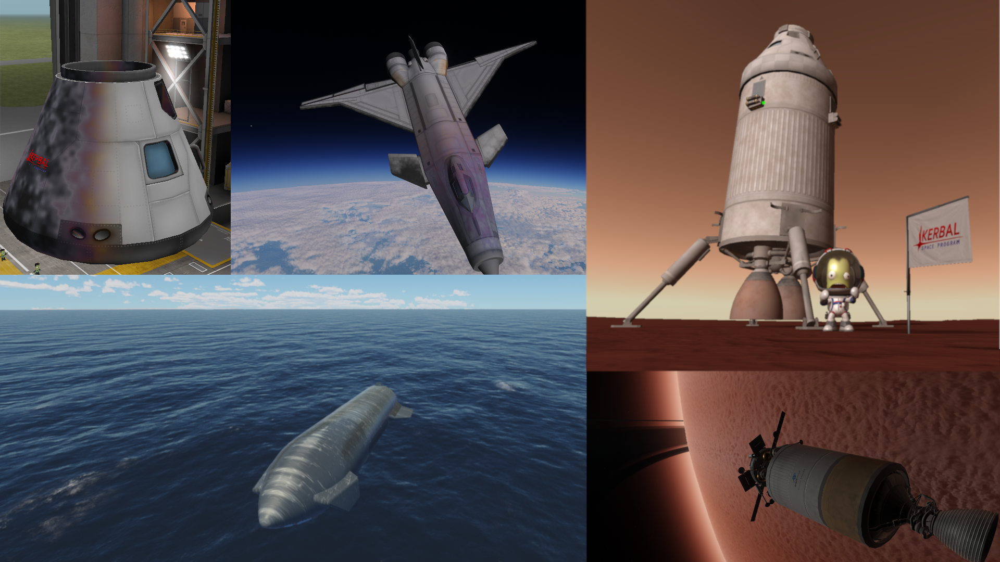

# Losket

Losket marks your craft with the flights it has been through. Re-entry scorches
the surfaces that took the heat, and engines and rotors coat the hull in dust the
colour of whatever you landed on. Both accumulate over a vessel's lifetime and
are saved with it.




## Requirements

- KSP 1.12.0 to 1.12.5
- ModuleManager

## Installation

Copy the `GameData/Losket` folder from the release archive into your KSP
`GameData` folder. To uninstall, delete that folder. Craft that were scorched
will simply load clean.

## Usage

Losket adds a toolbar button in the space centre, the editor and in flight. It
opens a small window with the global defaults. The same options also live in
Settings > Difficulty > Losket.

Everything else is per part, in the editor. Right-click a part and look for the
Losket group:

- Affected by — Nothing, Scorching, Dust, or Scorching and dust. Parts you will
  never see, or that sit inside a fairing, can be set to Nothing to save the
  work of rendering them.
- Preset — the look of the deposit. Soot is matte black with soft edges. Metal
  is lighter, sharper, and shows the full blue heat tint. Streaks is bleached
  and elongated, closer to how Starship comes back.
- Advanced settings — opens a window with the individual sliders: deposit
  colour, heat tint, bleaching, sharpness, pattern scale, streak length, and a
  blend between blotches and streaks. Touching any slider switches the preset to
  Custom.
- Preview scorching — shows the effect in the editor without flying.

In flight the same group reports how much scorching and dust the part has
accumulated, as a percentage.

Defaults apply to newly placed parts only. Changing them does not touch parts
that are already on the craft.

## Dust colour

Dust takes the colour of the ground below the vessel, from a table in
`GameData/Losket/Configs/dust-colors.cfg` rather than by sampling the terrain. All
stock bodies are covered. Bodies with no entry fall back to a neutral grey-brown.

Planet packs can add their own bodies with a ModuleManager patch:

```
LOSKET_BODY_DUST { body = MyBody  color = 0.5, 0.4, 0.3 }
```

How the dust lands depends on the atmosphere. In thick atmosphere it swirls
and settles from every direction; in thin air it is thrown further and hits the
sides of the craft. Engines fired over water, launchpads, runways and other
built surfaces raise nothing.

Dust is off in vacuum by default: the effect works but did not look convincing
in play. `GameData/Losket/Configs/losket-settings.cfg` holds the pressure
threshold (`dustMinPressureAtm`); set it to 0 to raise dust on the Mun and
Minmus too.

## Cleaning a part

An engineer on EVA gets a **Clean part** button in the part menu of any part
that carries scorching or dust, as long as the kerbal is within a few metres of
the part's surface. Recovering a vessel also cleans it.

## Dust rate

The Losket settings (toolbar button, or Difficulty > Losket) have a **Dust
rate** slider from x0.1 to x10. It scales how fast dust settles at the moment
it lands; dust already on a part is not changed.

## Compatibility

Tested against Deferred, Restock, TURD and TexturesUnlimited, and
against modded parts.

## Languages

English, French and Simplified Chinese. Adding a language means duplicating a
block in `GameData/Losket/Localization/losket.cfg` and translating it; no code
changes are involved.

## Building from source

See [docs/DEVELOPMENT.md](docs/DEVELOPMENT.md)
